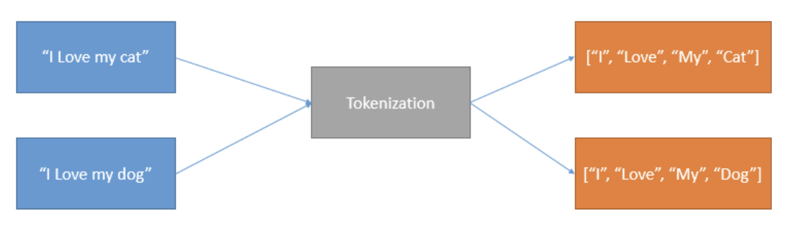
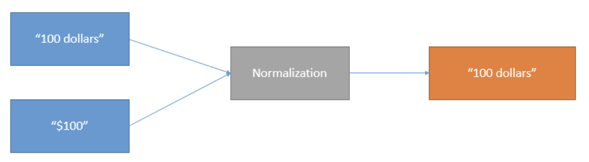
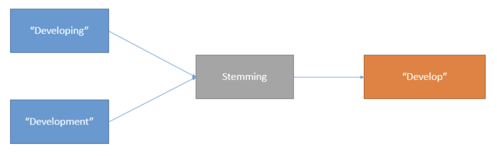
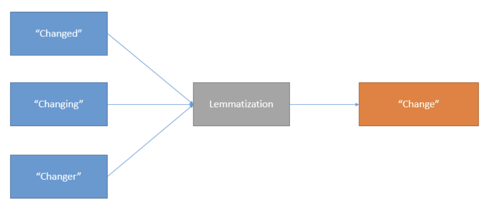

# Appendix 1.3 Text Pre-Processing in NLP

Goal: To break down noisy text into a form that ML models can digest. It cleans and prepares textual data for further analysis and reporting. 

## The different methods of Text Pre-processing

### Tokenization
Tokenization is the process of breaking down a piece of text into smaller chunks (tokens).

### Normalization
Normalization is the process of standardizing text by reducing different variations of words with similar meanings and transforming them into a single canonical form. 

### Stop Word Removal
Stop words like "is" and "are" are abundant in textual data, appearing so frequently that they don't need processing as thoroughly as nouns, verbs, and adjectives. Thus they can be safely disregarded without changing the meaning of the text.

### Stemming
Stemming is the process of removing prefixes and suffixes from words. 

### Lemmatization
Lemmatization is the process of reducing identical meaning words used in difference grammatical contexts into one singular form. 

### Stemming vs Lemmatization
Stemming operates a single word without knowledge of the context.
Cons: Cannot discriminate between words which have different meanings depending on part of speech. 
Pros: Easier to implement, run faster

Lemmatization keeps in mind the context of the word in the sentence while performing the reduction.
Cons: Harder to implement, runs slower
Pros: Keeps in mid the context, so it will be more correct than stemming. 

For instance:

1.  The word "better" has "good" as its lemma. This link is missed by stemming, as it requires a dictionary look-up.
    
2.  The word "walk" is the base form for word "walking", and hence this is matched in both stemming and lemmatisation.
    
3.  The word "meeting" can be either the base form of a noun or a form of a verb ("to meet") depending on the context, e.g., "in our last meeting" or "We are meeting again tomorrow". Unlike stemming, lemmatisation can in principle select the appropriate lemma depending on the context.