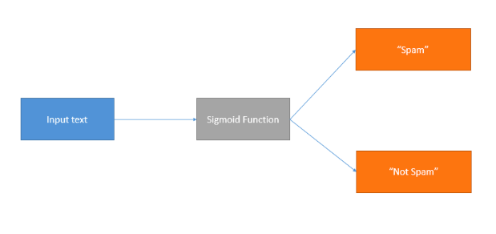
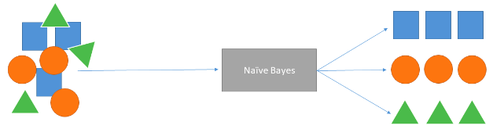
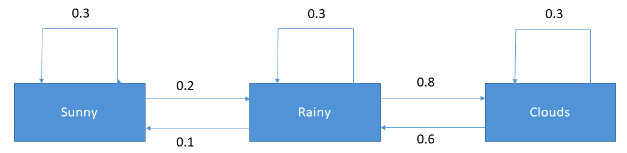

# Appendix 1.5 Past Machine-Learning Methods of NLP

## N-Gram Models
- built by training on sequential text data
- count how often word sequences appear in the text and estimate the probability distribution of the word sequences. 
- best suited for auto-completion or auto spell-checking

## Logistic Regression
- generates a value from 0-1 for any given numerical input, which is the probability of the input belonging to a particular class
- useful for classification tasks like spam detection

## Naive Bayes

- uses probability to predict the likelihood of a class being the outcome
- uses Bayes' Theorem, naive assumes that the features in the data are independent of each other.
- best-suited for sentiment analysis because it can offer good probabilistic results because of the independence rule

## Markov Models
- good for sequential data
- work well for predicting the probabilities of sequences of random variables
- used well for natural language generation

