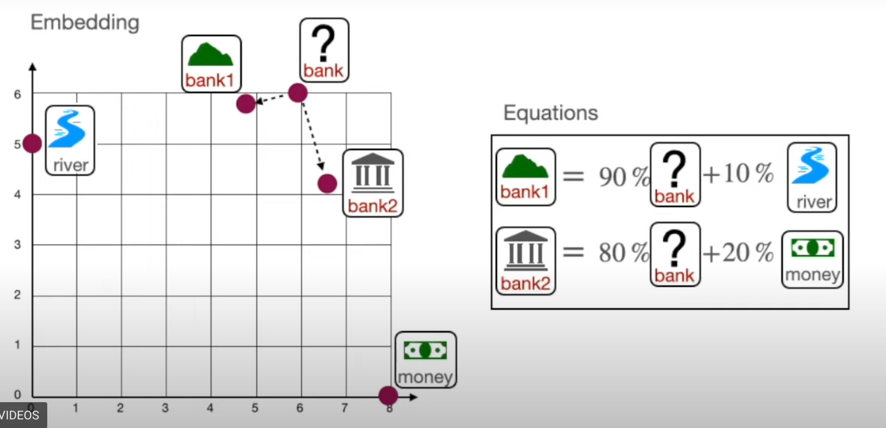

# Module 1.3 The Attention Mechanism

Attention is the idea of using the context of the sentence to give a word a more specific and accurate meaning. For example, there is a river bank and a bank for money. This difference is found though the similarities between bank and other words in the sentence.

"The bank of the river" finds a 0.11 similarity between bank and river, thus bank1 becomes closer to river and river1 becomes closer to bank. Bank1 becomes 1/1.11 bank and 0.11/1/11 river, resulting in 90% bank 10% river. This calculation also applies to river1, becoming 90% river, 10% bank.

"Money in the bank", using the same calculation, results in bank2 being 80% bank, 20% money. 

Bank1 and bank2, each closer two different values, becomes two different points on the vector.

