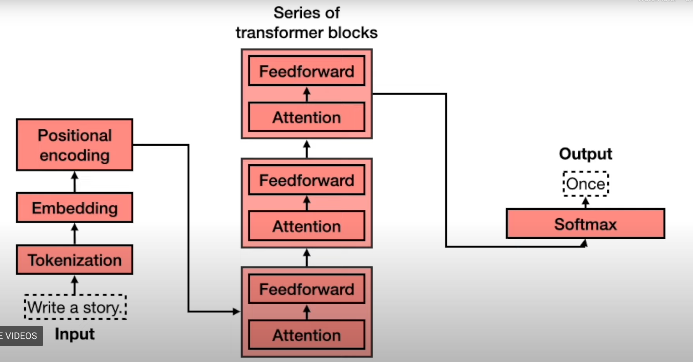

# Module 1.4 Transformer Models

A transformer model guesses the next word in the sentence (similar to the word suggestions on phone keyboards). The words that are currently typed are fed into a neural network which tries to guess the next word. The neural network outputs probabilities for which word should come next.

Transformer models take the context into consideration (unlike phone next word suggestions). This makes the sentences of transformer models make sense. 

## Neural Networks vs. Transformers

A neural network consists of many feedforward "layers", and the output of one layer is fed into the input of another, and they form a sort of chain. 

A transformer is a neural network but with some enhancements. 

### Transformer Architecture

## Transformer Components
### 1. Tokenization
Tokenization takes each word in the input sentence and turns them into tokens. There are tokens for every word and punctuation sign.

### 2. Embedding
The embedding stage turns each token into numbers (vectors). Recall that similar words go with similar numbers.

### 3. Positional Encoding
Gives order to the sentence. For example, "I'm not sad, I'm happy" and "I'm not happy, I'm sad" have opposite meanings, but their embeddings are identical. Positional encoding is done by adding a different sequential vector to each word in the sentence depending on their position in the sentence. This ensures that sentences that contain identical words in a different order will have different embeddings. 

### 4. Transformer Blocks
Made up of many layers. Each layer has an attention block and a feedforward block. 

The attention helps differentiate between words with many meanings (I.e. riverbank and money bank). 

The feedforward block is just a neural network.

So really, a transformer is just a neural network with attention layers added between each feedforward layer.

### 5. Softmax
The softmax adds some variability to the response. The transformer returns scores for what the next word should be. The softmax then turns those scores into probabilities and selects the word by sampling on the probabilities. This ensures that given the same input, the output won't be the same every single time.

## Problem 1: Getting a response
We want the transformer model to provide a response to our prompt. However, the transformer is trained on the data from the internet, which is not generally in a question-answer format. 

## Solution 1
Postraining. After the transformer is trained on the internet data, it is then trained with specific curated datasets in a prompt-response format. This lets the transformer know that it should give an answer when prompted instead of responding with a similar question or something else.

## Problem 2: Context
For example, you can ask the transformer, "Who was the first person to win 2 Nobel prizes?". The transformer will respond and then you ask, "Where was she from?" Now the transformer model would have forgotten the first question you asked.

## Solution 2
Postraining again. This time on datasets of large conversations so that the transformer will start to know to keep previous queries in mind.

If you want a chatbot for a specific application, you can posttrain it on specialized data. Thus the posttraining stage is important for developers to make specialized chatbots to perform well at certain tasks.
