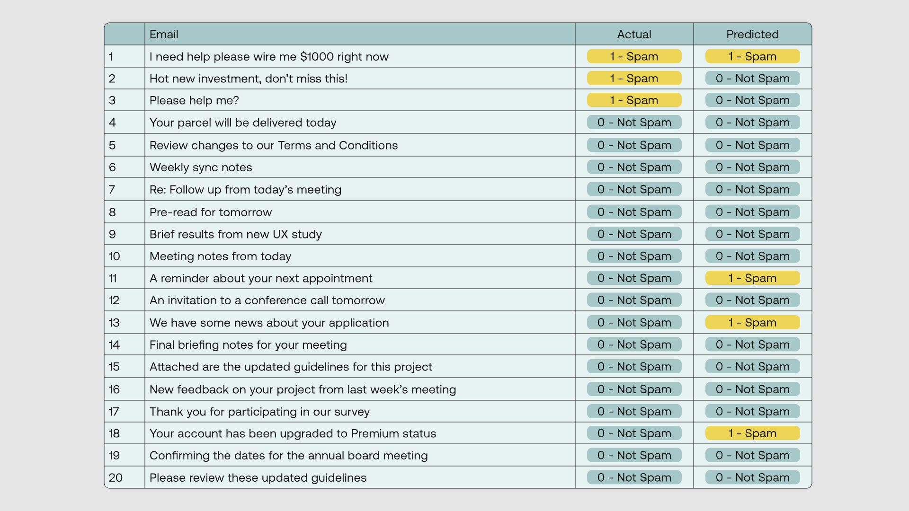
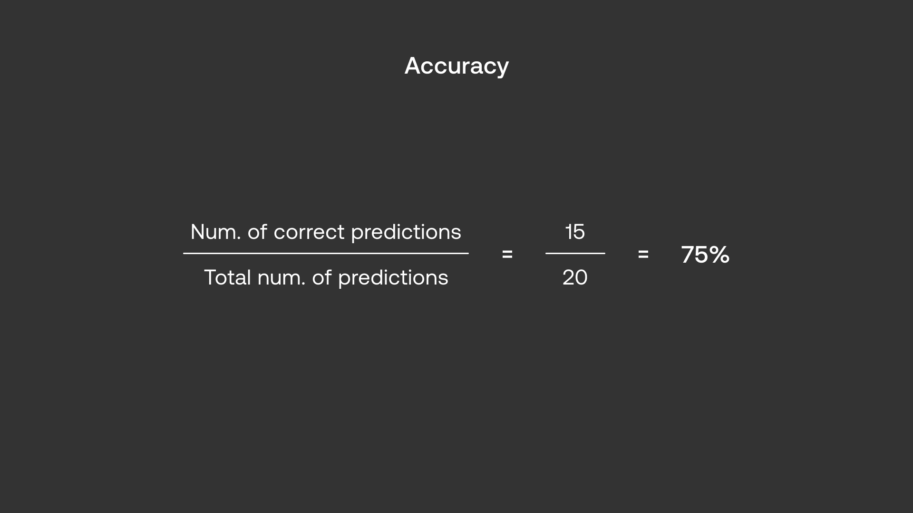
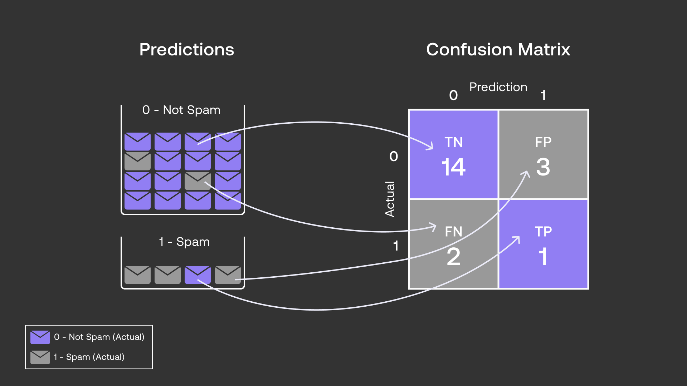
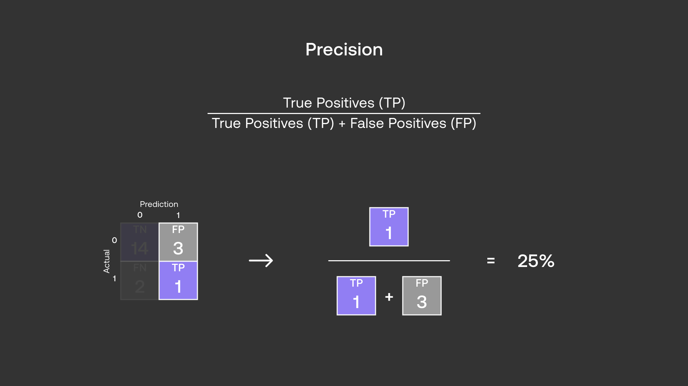
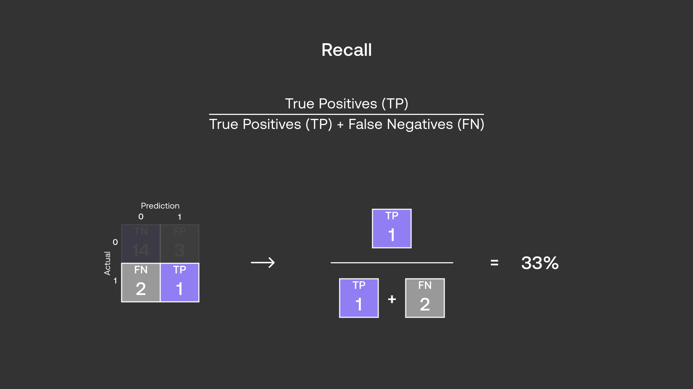
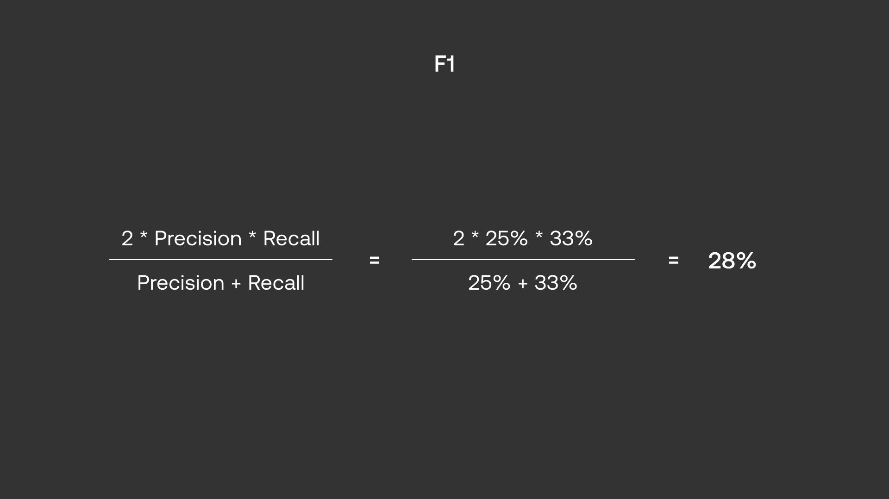
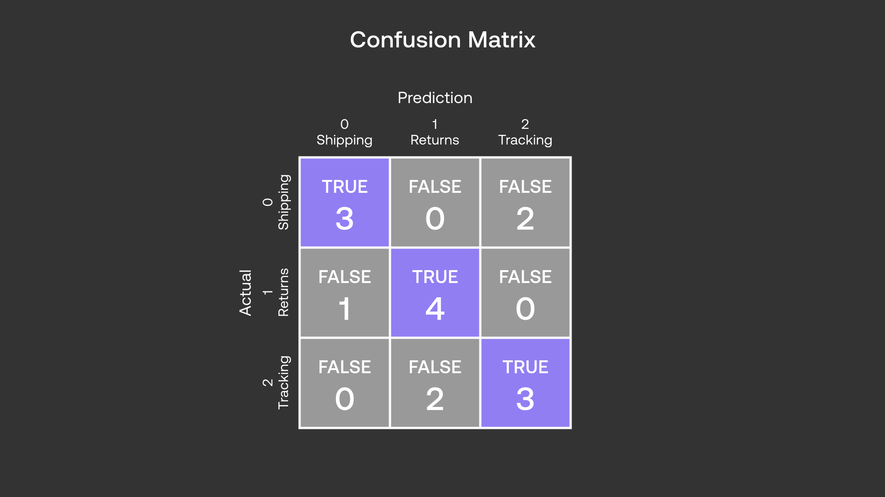
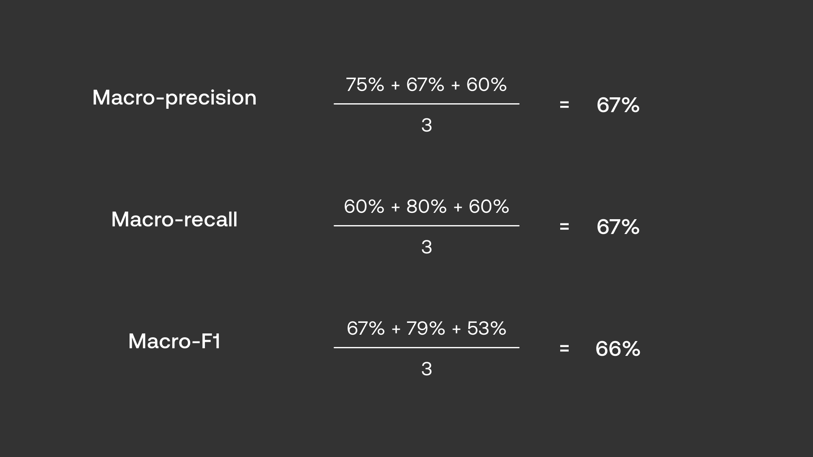

# Module 2.2 Classification Evaluation Metrics
There are 4 main evaluation metrics for classification models.

- Accuracy
- Precision
- Recall
- F1

## Binary Classification
Suppose that we want to classify 20 emails as spam and not spam. We have the expected result and the actual result that the classifier generates. We can compare these two results in order to evaluate the performance of the classification model. 

### Accuracy

Pros: Simple to compute, easy to interpret
Cons: Misleading when dealing with **imbalanced data**.

Imbalanced data happens when certain classes (categories) contain way more data points than others.

In our case,  because we have 17 "not spams" out of 20, if the classifier simply classified everything as not spam, it would be 85% correct! This happens because the number of non spams is much higher than spam emails.

## Confusion Matrix
The confusion matrix will allow us to better use the other 3 metrics to measure a classifier's true performance.

The confusion matrix has 4 categories (for a binary classifier).

- True Positive (TP): Actual = 1, Predicted = 1
- True Negative (TN): Actual = 0, Predicted = 0
- False Positive (FP): Actual = 0, Predicted = 1
- False Negative (FN): Actual = 1, Predicted = 0

## Precision
TP / (TP + FP)

Does not include True Negatives and False Negatives

## Recall
TP / (TP + FN)

Does not include True Negatives and False Positives

### Tradeoff between Precision and Recall
Precision excludes FNs.
Recall excludes FPs.

Higher precision will result in low recall and vice versa. Thus how do we decide which to prioritize?

It depends on the usecase of the chatbot. Consider the previous usecase of a spam email detector.
| Precision | Recall | FN vs FP | Meaning | 
|--|--|--|--|
|high|low|high-low|more spam gets flagged as non-spam|
|low|high|low-high|more non-spam gets flagged as spam|

We probably prefer for more spam to get flagged as non spam than the other way around. Thus we would want to prioritize high precision, low recall.

## F1
If both precision and recall are important, we use F1. 

## Multi-class Classification
Similar to Binary Classification, but would have a nxn confusion matrix instead of 2x2 where n is the number of classes.

This would mean we can calculate a precision, recall, and F1 for each class. What if we only want one overall precision, recall and F1?

Use macro-precision, macro-recall, and macro-F1, obtained by taking the average of all respective precisions, recalls, and F1s.

