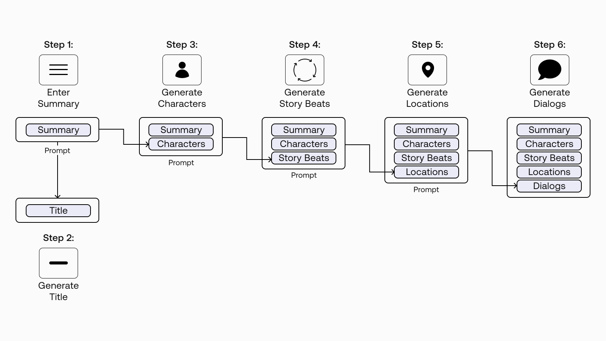

# Module 3.6 Chaining Prompts

The basis of this module will be done through a story generation model. We want to generate each part of the story through chaining prompts together.

## Why Multi-Step Generation?
1. Context Length. LLMs ave a limit they can generate in one call (Cohere's Generate endpoint's is 2048)
2. Control over output quality.  When writing stories, we go through different phases like character development, environment setting, story arc, etc.

## Step 1. Provide Story Descriptions and Generate Title

    log_line = """Scifi cyberpunk story about two hackers who find themselves both the targets of a cyber intelligence agent who suspects them of stealing $3.5 million worth of Bitcoin. The two do not know each other, and neither of them recalls stealing the sum.
#@title Generate Title Suggestions { display-mode: "form" }

  

prompt_title_scifi = """Examples of alternative, original and descriptive titles for known play and film scripts.

  

Example 1. A science - fiction fantasy about a naive but ambitious farm boy from a backwater desert who

discovers powers he never knew he had when he teams up with a feisty princess, a mercenary space pilot

and an old wizard warrior to lead a ragtag rebellion against the sinister forces of the evil Galactic

Empire. Title: The Death Star's Menace <end>

  

Example 2. Residents of San Fernando Valley are under attack by flying saucers from outer space. The

aliens are extraterrestrials who seek to stop humanity from creating a doomsday weapon that could

destroy the universe and unleash the living dead to stalk humans who wander into the cemetery looking

for evidence of the UFOs. The hero Jeff, an airline pilot, will face the aliens. Title: The Day The

Earth Was Saved By Outer Space. <end>

  

Example 3. {LOG_LINE} Title:"""

  

prompt = prompt_title_scifi.format(LOG_LINE=log_line)

  

titles = generate(prompt, temperature=0.9, max_tokens=20)

titles['generation'] = titles['generation'].str.replace('<end>','')

"""

Basically, log_line is the description we want Cohere to generate the title for. However, we should give it some examples of description and titles finetune (?) and steer it in the direction we want the prompt to be. 

Then, you basically just keep concatenating the results of each generation to the previous generations and feed it as a prompt to generate the next generation results.
